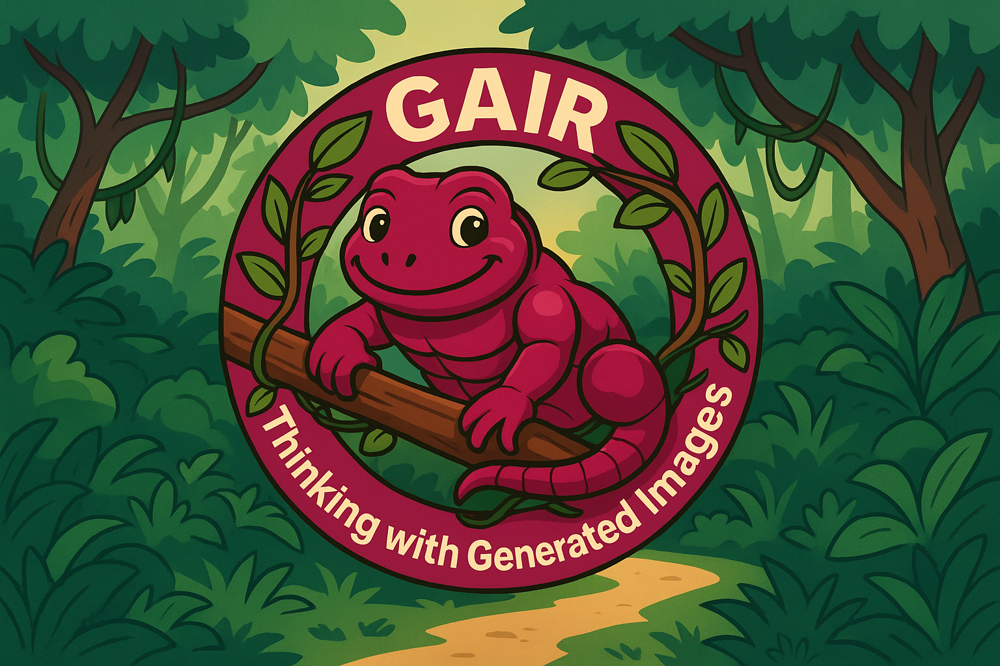

# 💡Thinking with Generated Images

<p align="center" width="100%">

</p>

<p align="center">
  📤 <a href="https://github.com/GAIR-NLP/thinking-with-generated-images#-get-started" target="_self">Get Started</a> &nbsp; | &nbsp;
  <!-- 🌐 <a href="https://gair-nlp.github.io/thinking-with-generated-images" target="_blank">Website</a> &nbsp; | &nbsp; -->
  📄 <a href="https://arxiv.org/abs/2505.22525" target="_blank">Preprint</a> &nbsp; | &nbsp;
  🤗 <a href="https://huggingface.co/GAIR/twgi-subgoal-anole-7b" target="_blank">Hugging Face (Subgoal)</a> &nbsp; | &nbsp;
  🤗 <a href="https://huggingface.co/GAIR/twgi-critique-anole-7b" target="_blank">Hugging Face (Critique)</a> &nbsp; | &nbsp;
</p>

## 👋 Overview

We introduce *Thinking with Generated Images*, where we enable **a single LMM (Large Multimodal Model) to spontaneously generate and reason with intermediate visual thoughts** via a *native long-multimodal thought process*.

<p align="center">
    
</p>

## 💭 Thinking Evolution

We demonstrate the evolution from passive *seeing with images* (single image ingestion), to *thinking with images* (multi-step transformations of the input image), and finally to *thinking with generated images*, where the model itself generates multimodal tokens to help with thinking and solving more complex tasks. Below, we showcase a few example scenarios under each concept.

<p align="center">
    
</p>

Under the *thinking with generated images* paradigm, we also distinguish between agentic, module-heavy approaches with our unified, single-model approach, which interleaves visual and textual tokens through one autoregressive pass that naturally enables test-time scaling.
 
<p align="center">
    
</p>

## 📊 Examples

**Anole-7b vs. *Thinking with Generated Images* on GenEval**

<p align="center">
    
</p>

**Anole-7b vs. *Thinking with Generated Images* on DPG-Bench**

<p align="center">
    
</p>


## 🔍 Methodology

We implement our *Thinking with Generated Images* paradigm by supervised fine-tuning unified autoregressive LMMs (e.g., Anole-7b) on a curated dataset of interleaved text–vision reasoning chains. This fine-tuning optimizes a composite loss that combines standard cross-entropy on multimodal tokens with a visual feature reconstruction term to ensure both semantic coherence and high-fidelity image outputs. Furthermore, this approach **interleaves text and vision tokens to natively perform visual sub-goal decomposition and self-critique, and leverages test-time scaling to significantly improve vision generation quality.**

## 🚀 Get started

### Installation

1. Download the model: [twgi-subgoal-anole-7b](https://huggingface.co/GAIR/twgi-subgoal-anole-7b) or [twgi-critique-anole-7b](https://huggingface.co/GAIR/twgi-critique-anole-7b)
```
huggingface-cli download --resume-download GAIR/twgi-critique-anole-7b --local-dir twgi-critique-anole-7b --local-dir-use-symlinks False
huggingface-cli download --resume-download GAIR/twgi-subgoal-anole-7b --local-dir twgi-subgoal-anole-7b --local-dir-use-symlinks False
```
2. Install requirements and `transformers` from the `chameleon` branch (already included in this repo). This transformers library is modified from [leloykun's implementation](https://github.com/leloykun/transformers/tree/fc--anole).
```
bash install.sh
```


### Inference
The inference code supports *vision generation with intermediate visual sub-goals* and *vision generation with self-critique*. We also support general multimodal generation on the original [Anole-7b](https://github.com/GAIR-NLP/anole). Remember to download the corresponding model ([twgi-subgoal-anole-7b](https://huggingface.co/GAIR/twgi-subgoal-anole-7b), [twgi-critique-anole-7b](https://huggingface.co/GAIR/twgi-critique-anole-7b), [Anole-7b](https://huggingface.co/GAIR/Anole-7b)) and specify the model path in `./inference/inference.sh`. 
```
cd inference
bash inference.sh
bash detokenization.sh
```


### Training
We have open-sourced our training code and provided a minimal dataset for testing the training pipeline. Remember to specify the initial and trained model path in `./training/train.sh`.
```
cd training
bash train.sh
```
We also provide the example data tokenization code in `./training/tokenization.py`.


## 🛠️ Models

| Model Name        | HF Checkpoints                                               | License                                                      |
| ----------------- | ------------------------------------------------------------ | ------------------------------------------------------------ |
| twgi-subgoal-anole-7b  | 🤗 <a href="https://huggingface.co/GAIR/twgi-subgoal-anole-7b" target="_blank">7B</a> |[Chameleon License](https://ai.meta.com/resources/models-and-libraries/chameleon-license) |
| twgi-critique-anole-7b  | 🤗 <a href="https://huggingface.co/GAIR/twgi-critique-anole-7b" target="_blank">7B</a> |[Chameleon License](https://ai.meta.com/resources/models-and-libraries/chameleon-license) |

## 📝 Usage and License Notices
The trained models based on anole follow the same license as [Chameleon](https://ai.meta.com/resources/models-and-libraries/chameleon-license).

## Citation
Please cite our [paper](https://arxiv.org/abs/2505.22525) if you find the repository helpful.
```
@article{chern2025thinkingwithgeneratedimages,
  title={Thinking with Generated Images},
  author={Chern, Ethan and Hu, Zhulin and Chern, Steffi and Kou, Siqi and Su, Jiadi and Ma, Yan and Deng, Zhijie and Liu, Pengfei},
  journal={arXiv preprint arXiv:2505.22525},
  year={2025}
} 
```
